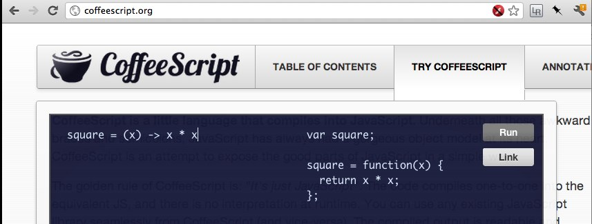

!SLIDE
    @@@ javascript
    var square = function(x) {
      return x * x;
    }

!SLIDE
    @@@ javascript
    var square = function(x)
      return x * x;

!SLIDE
    @@@ javascript
    var square = (x) ->
      return x * x;

!SLIDE
    @@@ javascript
    square = (x) ->
      return x * x;

!SLIDE
    @@@ javascript
    square = (x) ->
      return x * x

!SLIDE
    @@@ javascript
    square = (x) ->
      x * x

!SLIDE
    @@@ coffeescript
    square = (x) -> x * x

!SLIDE center
